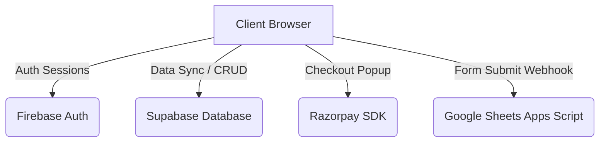

# CodeMiners Hackathon Portal — Developer Documentation

Welcome to the **CodeMiners Hackathon Portal** codebase! This documentation outlines the system architecture, database schemas, cryptographic field-level encryption (E2EE), deployment flows, and external integrations (Razorpay and Google Sheets) to help other developers pick up and build on the project instantly.

---

## 🏗️ System Architecture

The project is built as a serverless static web application deployed on **Firebase Hosting** that interfaces directly with client-side software-as-a-service (SaaS) APIs:



### 1. Core Stack
* **Frontend**: HTML5, Vanilla CSS3 (Custom Orbitron/Space Grotesk theme), and JavaScript.
* **Authentication**: Firebase Authentication (Email/Password, Google Sign-In, GitHub Sign-In).
* **Database**: Supabase PostgreSQL (utilizing Client-Side JS libraries with row-level security).
* **Payments**: Razorpay Checkout SDK.
* **Data Logging**: Google Sheets Webhook redirection.

---

## 🔒 Cryptographic Security & E2EE

To safeguard participant data (such as phone numbers and college IDs) against database breaches or unauthorized scraping, the system uses client-side field-level encryption utilizing **CryptoJS (AES-CBC)** and **SHA-256 Blind Indexing**:

### 1. Multi-Tier Key Derivation
* **User-Specific Key**: Derived deterministically using `CryptoJS.SHA256(user.uid + CRYPTO_SALT)`. Only the authenticated owner of the data holds this key, making it fully End-to-End Encrypted (E2EE). Used for `phone`, `pin` / `id_value`, `about`, and `projects`.
* **Global Key**: Derived from `GLOBAL_SALT`. Used to encrypt `college` names so any logged-in portal participant can decrypt and render college affiliations, while external database sniffers see only unreadable ciphertext.

### 2. Blind Indexing for Uniqueness Checks
Because AES ciphertexts are randomized (due to changing Initialization Vectors) and cannot be directly queried in a database, unique checks (e.g. *preventing a PIN from being registered twice*) are verified using a blind index:
* **Index Formula**: `CryptoJS.SHA256(idValue + GLOBAL_SALT).toString()`
* Stored as a JSON block in the database: `{"cipher": "AES_CIPHERTEXT", "hash": "SHA256_HASH"}`
* Verified using Supabase pattern matching queries: `.like('id_value', '%"hash":"<SHA256_HASH>"%')`.

---

## 📊 Database Schemas (Supabase)

### `profiles` Table
Stores user profile information. Fields like `pin`, `about`, and `projects` are stored as AES-CBC ciphertext.

| Column | Type | Description |
| :--- | :--- | :--- |
| `id` | `UUID` (Primary Key) | Maps 1:1 with Firebase Auth User UID (`user.uid`). |
| `email` | `TEXT` | User's email address (Plaintext). |
| `full_name` | `TEXT` | User's display name (Plaintext, locked after first entry). |
| `username` | `TEXT` | Generated username based on email. |
| `pin` | `TEXT` | Encrypted PIN / Hall Ticket number (User Key). |
| `about` | `TEXT` | Encrypted user biography (User Key). |
| `projects` | `TEXT` | Encrypted JSON list of projects (User Key). |
| `created_at` | `TIMESTAMPTZ` | Record creation timestamp. |

### `registrations` Table
Tracks event and hackathon signups.

| Column | Type | Description |
| :--- | :--- | :--- |
| `id` | `BIGINT` (Primary Key) | Auto-incrementing identifier. |
| `full_name` | `TEXT` | Submitting user's full name. |
| `email` | `TEXT` | Submitting user's email address. |
| `phone` | `TEXT` | Encrypted phone number (User Key). |
| `college` | `TEXT` | Encrypted college name (Global Key). |
| `year` | `TEXT` | Study year (`first`, `second`, `third`, `fourth`). |
| `id_type` | `TEXT` | ID category (`hallticket` or `pin`). |
| `id_value` | `TEXT` | JSON string containing `cipher` and `hash` fields. |
| `role` | `TEXT` | Role type (`leader` or `member`). |
| `event_name` | `TEXT` | Target event (e.g., `CodeMiners Hackathon 2026`). |
| `team_name` | `TEXT` | Team name associated with registration. |
| `team_size` | `INTEGER` | Total size of the team at payment confirmation. |
| `payment_id` | `TEXT` | Razorpay transaction ID. |
| `payment_status` | `TEXT` | Payment status (e.g. `captured`, `free`). |
| `amount_paid` | `NUMERIC` | Registration fee paid in INR (₹). |
| `created_at` | `TIMESTAMPTZ` | Record creation timestamp. |

---

## 💳 Razorpay & Tiered Pricing

The Hackathon registration utilizes a tiered pricing model based on team size:
* **Less than 5 members**: ₹70 per head (e.g., a team of 4 pays ₹280).
* **Exactly 5 members**: ₹50 per head (a team of 5 pays ₹250).

Registration payments are managed directly inside the **Team Management Dashboard** for team leaders. Individual members cannot trigger payment; they see an awaiting/pending banner until the leader completes the transaction.

---

## 📈 Google Sheets Webhook Integration

Every successful registration triggers a client-side webhook request to sync spreadsheet records.

### 1. Webhook Script Setup (Google Apps Script)
To configure the receiving spreadsheet:
1. Open your target Google Sheet.
2. Navigate to **Extensions** > **Apps Script**.
3. Clear default code and paste the following script:

```javascript
function doPost(e) {
  try {
    var sheet = SpreadsheetApp.getActiveSpreadsheet().getActiveSheet();
    var data = JSON.parse(e.postData.contents);
    
    sheet.appendRow([
      new Date(),
      data.full_name || '',
      data.email || '',
      data.phone || '',
      data.college || '',
      data.year || '',
      data.id_type || '',
      data.id_value || '',
      data.role || '',
      data.event_name || '',
      data.team_name || '',
      data.team_size || '',
      data.payment_id || '',
      data.payment_status || '',
      data.amount_paid || ''
    ]);
    
    return ContentService.createTextOutput(JSON.stringify({ status: "success" }))
      .setMimeType(ContentService.MimeType.JSON);
  } catch (err) {
    return ContentService.createTextOutput(JSON.stringify({ status: "error", message: err.toString() }))
      .setMimeType(ContentService.MimeType.JSON);
  }
}
```
4. Click **Deploy** > **New Deployment**.
5. Set type to **Web App**, execution as **Me**, and access to **Anyone**.
6. Copy the generated Web App URL and paste it as the webhook endpoint in your codebase.

---

## 🛠️ Build, Development & Deployment

To prevent users from viewing payment or integration mechanics, frontend JavaScript is minified and obfuscated in production.

### 1. Build Commands
Ensure Node.js is installed, then run the minification script:
```bash
# Minify Authentication script
npx terser app.js -o app.min.js --mangle --compress

# Minify Portal Operations script
npx terser portal-script.js -o portal-script.min.js --mangle --compress
```

### 2. Syntax Validation
Before staging files, check script validity to prevent execution crashes:
```bash
node -c portal-script.js
```

### 3. Deploy to Production (Firebase Hosting)
```bash
# Deploy only hosting assets
npx firebase-tools deploy --only hosting
```

---

## ⚙️ Domain Redirection
A domain redirection listener is integrated into the `<head>` of all HTML files. Any visit to `codeminer.web.app` is trapped and redirected cleanly to `codeminer.firebaseapp.com` to maintain unified user sessions.
